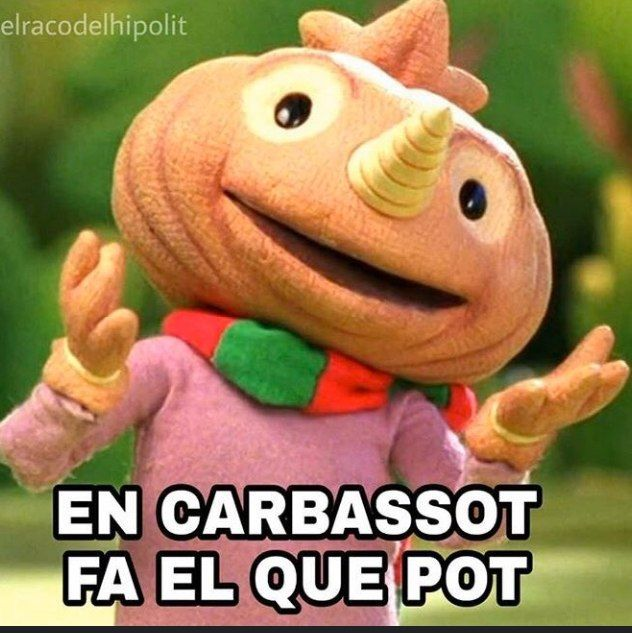

# 🍆 Encarbassot fa el que pot

**Hi! I'm Encarbassot** — a multi-passionate maker who does what he can... and usually ends up doing quite a lot.

- 💻 Frontend & backend development
- 🔩 Hardware hacking (Arduino, 3D printing, laser cutting, enclosures)
- 🧵 Fabric crafting & bikepacking gear [fabri.cat]\(fabri.cat)
- 📹 Content creation (YouTube, Instagram)
- 🔧 Workshop management
- 📦 Logistics & internal tooling (for mobility startups)
- 🧊 Speedcubing (Rubik’s Cube)

---

## 🎓 My learning path

I’ve always been a curious and self-taught person. Alongside my formal education, I’ve constantly built personal projects — from console-based Rubik’s cube simulators to full-stack web tools or physical devices. That habit of making has always pushed me to explore beyond what’s taught in schools and to stay updated with the latest technologies.

- CFGM in Electronics & Telecommunications
- CFGS in Industrial Automation & Robotics (ARI)
- CFGS in Web Application Development (DAWe)
- University studies in Industrial Engineering (3 years)
- University studies in Computer Science (3 years)

From Excel-based programs back in 2014 to learning VBA and Arduino at school, to coding full apps in JavaScript — learning by doing has always been my favorite route.

---

## 💼 Work & Projects

Frontend developer (React) at [ION Smart](ionsmart.eu)

Workshop Manager & Lead Developer at [Panot Mobility](panotmobility.com)

[fabri.cat](fabri.cat) — handmade & laser-cut bikepacking gear

[fabrega.cat](fabrega.cat) — personal site

[lamess.es ](lamess.es) — bike messenger platform

---

## 🎯 Philosophy

> Creativity is my compass. Code, tools, fabric, sensors, bicycles — it’s all part of the same universe. I build stuff because I believe ideas deserve a body.
It took me a while to understand what I wanted to do, because honestly, there are just too many things I love doing. In another life, maybe I would’ve studied Product Design. But instead of choosing only one path, I’ve followed the thread of curiosity — from school to side projects, from code to craft.

I’ve always kept a strong autodidact mindset. School taught me the basics, but it was in my personal experiments where I found the real spark. That constant desire to make something — anything — has been my north star. And even when things don't seem to connect at first, I trust the process. Eventually, everything finds its place.

---

### 👾 Want to connect?

- 📸 Instagram: [@elioputo](https://instagram.com/elioputo)
- 📹 YouTube: [Eloi Fàbrega](https://www.youtube.com/c/EloiF%C3%A0brega)
- 🧑‍💻 Web: [fabrega.cat](https://fabrega.cat)

---

"Encarbassot fa el que pot" — a humble Catalan motto that means *"he does what he can."*\
And I do. With all my heart 💜

Thanks for reading the whole description — I really appreciate it 💫

